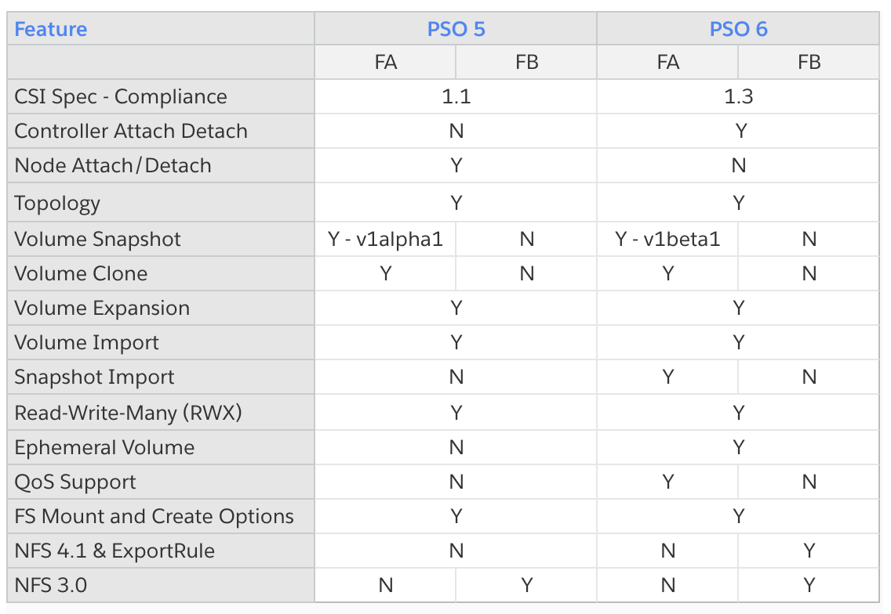

# Pure Service Orchestrator (PSO) CSI Driver

## !!NOTICE!! - PSO is going to be EOL July 31, 2022. New customers should start with [Portworx](https://portworx.com/).

_Using Google Anthos or OpenShift 3.11? Please use [PSO 5.x](https://github.com/purestorage/helm-charts) instead_

## What is PSO?

Pure Service Orchestrator (PSO) delivers storage-as-a-service for containers, giving developers the agility of public cloud with the reliability and security of on-premises infrastructure.

**Smart Provisioning** 
PSO automatically makes the best provisioning decision for each storage request – in real-time – by assessing multiple factors such as performance load, the capacity and health of your arrays, and policy tags.

**Elastic Scaling** 
Uniting all your Pure FlashArray™ and FlashBlade™ arrays on a single shared infrastructure, and supporting file and block as needed, PSO makes adding new arrays effortless, so you can scale as your environment grows.

**Transparent Recovery** 
To ensure your services stay robust, PSO self-heals – so you’re protected against data corruption caused by issues such as node failure, array performance limits, and low disk space.

## Feature List

## Software Pre-Requisites
**PLEASE READ THROUGH ALL OF THESE!**
Some of these requirements have changed since PSO 5.x, and not following them _will_ result in a non-functional plugin installation.

- #### Operating Systems Supported*:
  - CentOS 7
  - Red Hat CoreOS 4.4+
  - RHEL 7
  - Ubuntu 16.04
  - Ubuntu 18.04
  - Ubuntu 20.04
- #### Environments Supported*:
  - Kubernetes 1.17-1.21
    - [Note: For version less than 1.17.6/1.18.6 please refer to this issue using vxlan with Flannel or Calico](https://github.com/kubernetes/kubernetes/issues/87852)
  - Minimum Helm version required is 3.1.0.
  - Amazon EKS 1.17.6
  - Anthos Bare-Metal 1.6
  - OpenShift 4.4+
    - [Note: Please read and action these pre-requisites for OpenShift deployments](docs/openshift_mc.md)
- #### Other software dependencies for all cluster nodes:
  - Latest linux multipath software package for your operating system (Required) [Note: Multipath on Amazon EKS](docs/eks-multipathd-fix.md)
  - Latest external array management library package `libstoragemgt_udev` (Required) **[Red Hat and CentOS only]**
    - [Note: ensure the second action - CAPACITY_DATA_HAS_CHANGED - is uncommented and udev service is restarted]
  - Latest Filesystem utilities/drivers (XFS by default, Required)
  - Latest iSCSI initiator software for your operating system (Optional, required for iSCSI connectivity)
  - Latest NFS software package for your operating system (Optional, required for NFS connectivity)
  - Latest FC initiator software for your operating system (Optional, required for FC connectivity, *FC Supported on Bare-metal K8s installations only*)
  - Latest NVMe initiator software for your operating system (Optional, required for NVMe connectivity, *NVMe Supported on Bare-metal K8s installations only*), check [here](./docs/flasharray-nvmeof.md) for more details 
  - Ensure that IPv4 forwarding is enabled to allow inter-node communication. See here for more [details](docs/ipv4_forwarding.md). **This is important in Rancher deployments**
  - **An NTP implementation (such as `ntpd` or `chronyd`) is installed and running on all Kubernetes cluster nodes**
  - All backend arrays accessed by PSO must sync to the same time source as the rest of the Kubernetes cluster.
  - **Minimum 3+ nodes for database, recommended 5+** (Other workloads can use these nodes as well, they do not have to be dedicated)
  - File system utilities required to support `GetNodeVolumeStats` functionality.
- #### FlashArray and FlashBlade:
  - The FlashArray and/or FlashBlade should be connected to the worker nodes using [Pure's best practices](https://support.purestorage.com/Solutions/Linux/Reference/Linux_Recommended_Settings)
- #### FlashArray User Privileges
  - It is recommend to use a specific FlashArray user, and associated API token, for PSO access control to enable easier array auditing.
  - The PSO user can be local or based on a Directory Service controlled account (assuming DS is configured on the array).
  - The PSO user requires a minimum role level of `storage_admin`.
- #### FlashBlade User Privileges
  - If the FlashBlade is configured to use Directory Services for array management, then a DS controlled account and its associated API token can be used for PSO.
  - The PSO user requires a minimum array management role level of `storage_admin`.
  - Currently there is no option to create additional local users on a FlashBlade.

_* Please see release notes for details_

## Hardware Pre-Requisites

PSO can be used with any of the following hardware appliances and associated minimum version of appliance code:
  - Pure Storage FlashArray (minimum Purity code version 4.8)
      - minimum Purity v5.3.0 required to support the Storage QoS featureset
  - Pure Storage FlashBlade (minimum Purity version 2.2.0)

## Helm

If your Kubernetes deployment does not include Helm3 by default, then refer to the [Helm Installation](https://helm.sh/docs/intro/install/) documentation.

## PSO Helm Chart

The **pure-pso** helm chart deploys PSO CSI plugin on your Kubernetes cluster.

Refer to the [pure-pso README](./pure-pso/README.md) for the full installation process.

## PSO on the Internet

[Check out a list of some blogs related to Pure Service Orchestrator](./docs/blog_posts.md)

## Contributing
The PSO Helm Charts project is issued under the [Apache 2.0 license](https://github.com/purestorage/pso-csi/blob/master/LICENSE). We accept contributions via GitHub pull requests.

## Report a Bug
For filing bugs, suggesting improvements, or requesting new features, please open an [issue](https://github.com/purestorage/pso-csi/issues).
For bugs, please run this [script](./scripts/pso-collect-logs.sh) to collect all logs and send to [support@purestorage.com](mailto:support@purestorage.com) along with the issue ID. 
